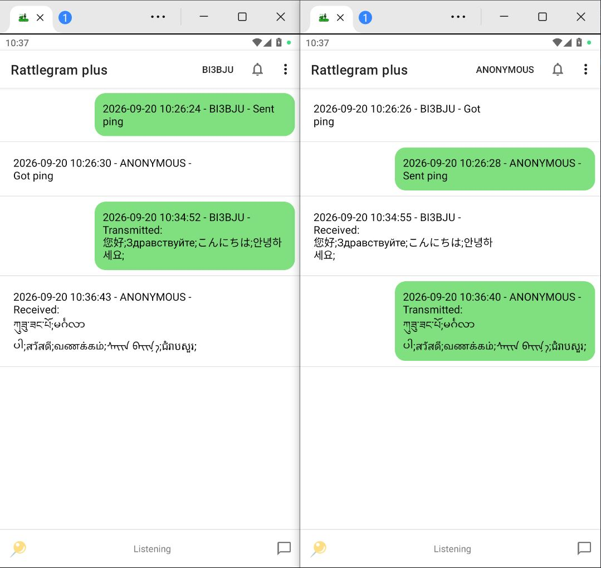

# Rattlegram Plus

[](LICENSE)
[](https://kotlinlang.org/)
[](https://developer.android.com/)
[](https://www.android.com/)
[](https://github.com/BI3BJU/rattlegram-plus)
[](https://github.com/BI3BJU/rattlegram-plus)

Rattlegram Plus is an Android app that enables short-range text communication via audio modulation/demodulation. It can encode text messages into audible or ultrasonic audio signals and decode these signals from the microphone, enabling point-to-point messaging without Wi‑Fi, Bluetooth, or cellular networks.

This project is a continuation of the original Rattlegram, enhanced with end-to-end encryption, location sharing, loop beacon, and a modern Material Design interface.

## Screenshots

| Main interface |
| :---: |
|  |

## Features

- 📡 **Audio-based messaging** – Send and receive text through sound (speaker and microphone).
- 🔐 **End-to-end encryption** – Optional password-based AES encryption (256-bit) for privacy.
- 📍 **Location sharing** – Share your GPS coordinates; recipients can open them in any map app.
- 🔁 **Relay mode** – Automatically repeat received messages (with debounce and delay).
- 📶 **Spectrum analyzer** – Real-time FFT and waterfall display for signal tuning.
- 🕊️ **Loop beacon** – Periodically send a ping (empty message) for presence detection.
- 🎚️ **Flexible audio settings** – Sample rate, channel selection, audio source, carrier frequency, noise symbols.
- 🌙 **Night mode** – Dark theme support.
- 📨 **Message history** – Persistently stored and displayed as sent/received bubbles.
- 🗺️ **Send location** – Tap a received location message to open it in the system default app.
- 👤 **Contacts** – Automatically save new callsigns, mention contacts with @, and prompt when your own callsign is received.

## How It Works

The app uses a native C++ library (`librattlegram.so`) to perform FSK-based modulation and demodulation. Text messages are converted into audio frames, played through the speaker, and received through the microphone. The decoder synchronizes to the incoming signal, extracts the payload, and displays it.

- **Encoder** – Packs your message into structured frames (header + payload), adds error-correction symbols, and generates PCM audio samples.
- **Decoder** – Continuously analyzes microphone input, detects the preamble, synchronizes, and extracts the raw data.
- **Encryption** – When enabled, messages are encrypted before encoding and decrypted after decoding using the configured password.

## Installation

1. Download the latest APK from the [Releases page](https://github.com/BI3BJU/Rattlegram_Plus/releases).
2. Enable **Install from unknown sources** in Android settings.
3. Install and launch the app.
4. Grant microphone and location permissions when prompted.

> ⚠️ This app requires Android 5.0 (API 21) or higher.

## Building from Source

Clone the repository:

```bash
git clone https://github.com/BI3BJU/Rattlegram_Plus.git
cd rattlegram-plus
```

1. Open the project in Android Studio (Arctic Fox or later).
2. Build the native library (using CMake).
   - JNI source code is located under `app/src/main/cpp/`.
   - Make sure NDK and CMake are installed via SDK Manager.
3. Build and run the app on a device or emulator.

## Usage Guide

### 🗣️ Sending Messages

1. Tap the compose button (📝) in the bottom-right corner.
2. Enter text (up to 170 bytes).
3. Optionally check **Encrypt** (requires setting a password in the menu).
4. Tap **Send** – the audio will play, and the message will appear as "Sent".

### 📍 Sharing Your Location

1. Tap the location button (📍) in the bottom-left corner.
2. Grant location permission if not already granted.
3. The app will obtain the last known GPS/network location and prefill a `[LOC] geo:lat,lng` string in the compose dialog.
4. Send it like a normal message.

### 🔁 Relay Mode

- Enable from the menu: **Enable relay mode**.
- After receiving a message, it will be automatically resent after a configurable delay.
- Debounce prevents repeated forwarding of the same message within a set time.

### 📶 Spectrum Analyzer

- Select **Show spectrum** from the menu.
- A dialog appears showing real-time FFT (spectrum) and waterfall (spectrogram).
- Use it to fine-tune the carrier frequency or check signal quality.

### 🔐 Setting a Password

- Open menu → **Password**.
- Enter a password (8–256 bytes) or tap **Generate** to create a secure hex string.
- Once set, outgoing messages can be encrypted; received encrypted messages will be decrypted automatically.

### 🕊️ Loop Beacon

- Tap **Ping** from the menu – the app will send an empty message every minute.
- Tap again to stop.

### 🗺️ Opening Received Locations

- Tap any received message that starts with `[LOC] geo:`.
- The system will ask which map app to use (All‑In‑One Offline Maps preferred).

## Permissions

| Permission | Purpose |
| --- | --- |
| `RECORD_AUDIO` | Microphone access. |
| `ACCESS_FINE_LOCATION` | GPS location sharing. |
| `POST_NOTIFICATIONS` | Optional. Not used, but may appear on newer Android versions. |

## Configuration Options (Menu)

| Option | Description |
| --- | --- |
| Output / recording sample rate | 8, 16, 32, 44.1, 48 kHz |
| Channel selection | Mono / stereo / left / right / sum / analytic signal |
| Audio source | Default, microphone, camcorder, voice recognition, unprocessed |
| Carrier frequency | 1000 Hz – (sample rate / 2 – bandwidth) |
| Noise symbols | Add extra FEC symbols (0–22) |
| Relay delay | 0–8 seconds |
| Relay debounce | 0–120 seconds (prevents echo loops) |
| Enhanced header | Use a longer preamble for better synchronization |
| Night mode | On / off |
| Delete messages | Clear history |
| Force exit | Fully exit the app |

## Libraries and Dependencies

- **AndroidX** – Modern UI components and compatibility.
- **Native C++ library** – Custom FSK modem (not included here).
- **No external GMS / Play Services** – Location uses only Android's built-in `LocationManager`.

## Contributing

Contributions are welcome! Please open an issue or submit a pull request.

- Use the GitHub issue tracker to report bugs and feature requests.
- Follow the code style of the existing source code.

## License

This project is licensed under the 0BSD License – see the [LICENSE](LICENSE) file for details.

## Acknowledgments

- Original Rattlegram developed by Ahmet Inan <inan@aicodix.de>.
- Rattlegram Plus maintained by BI3BJU <guerilla1949@gmail.com>.

## Disclaimer

This app is provided "as is" for experimental and educational purposes. The author is not responsible for any misuse or damage caused by this software.